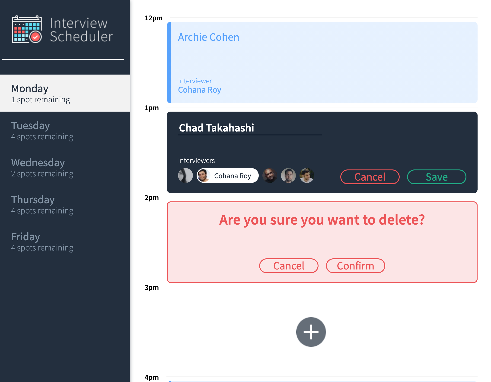

# Interview Scheduler

## Intro

This is a interview scheduler made as part of the Lighthouse web dev bootcamp. It is a single page app that allows users to book, edit, and cancel interviews within the single page environment. Various unit, intergration, and end to end tests implemented to ensure the correct functionality of the app.

## Screenshot



## Tech Stack

- React
- Webpack, Babel
- Axios
- Storybook, Webpack Dev Server, Jest

## Setup

Install dependencies with `npm install`.

## Running Webpack Development Server

```sh
npm start
```

## Running Jest Test Framework

```sh
npm test
```

## Running Storybook Visual Testbed

```sh
npm run storybook
```
